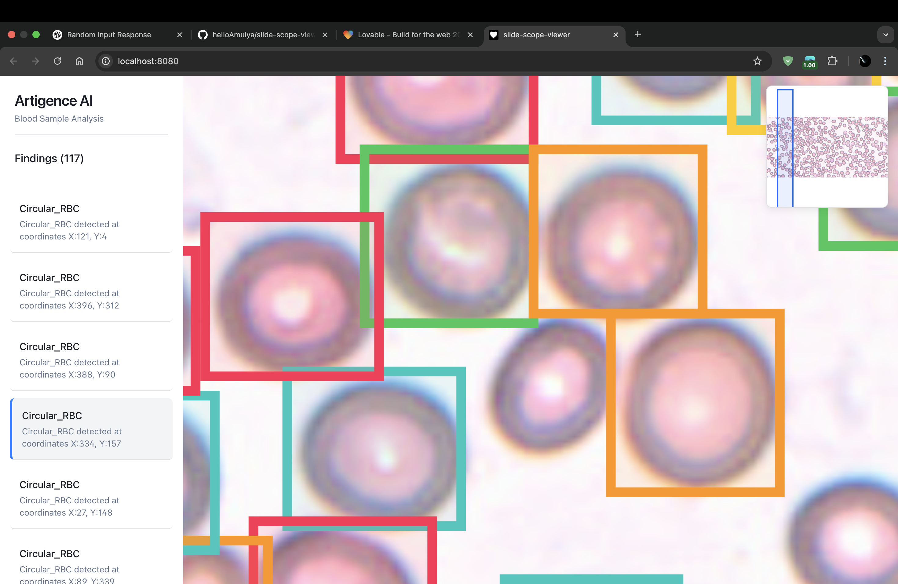

# Welcome to the Slide Scope Viewer Project

## Project Overview

This project is part of an **assignment** focused on building a **Whole Slide Image Viewer** with advanced zooming and annotation capabilities.

## Project Information

- **Repository**: [Slide Scope Viewer](https://github.com/helloAmulya/slide-scope-viewer)
- **Project URL**: [WSI Project](https://wsi-peach.vercel.app/)

## Showcase



### **Image Interaction**
The image is present in the viewer, but you need to **drag and move around** to explore different sections.

### **Using Your Preferred IDE (Locally)**

If you want to work locally using your own IDE, follow these steps:

#### **Prerequisites**
- Ensure **Node.js** and **npm** are installed. We recommend using **nvm**: [Install with nvm](https://github.com/nvm-sh/nvm#installing-and-updating)

#### **Setup Steps**
```sh
# Clone the repository using the project's Git URL.
git clone https://github.com/helloAmulya/slide-scope-viewer.git

# Navigate to the project directory.
cd slide-scope-viewer

# Install the necessary dependencies.
npm install

# Start the development server with auto-reloading and an instant preview.
npm run dev
```

### **Editing Files Directly in GitHub**
- Navigate to the file you want to modify.
- Click the **"Edit" (pencil) button**.
- Make changes and commit them.

### **Using GitHub Codespaces**
- Open the repository in GitHub.
- Click **"Code"** (green button) → **"Codespaces"** → **"New codespace"**.
- Edit files and commit changes directly.

## Technologies Used

This project is built using:

- **Vite** (for fast development & bundling)
- **TypeScript** (for type safety)
- **React.js** (for UI components)
- **shadcn-ui** (for modern UI components)
- **Tailwind CSS** (for styling)

